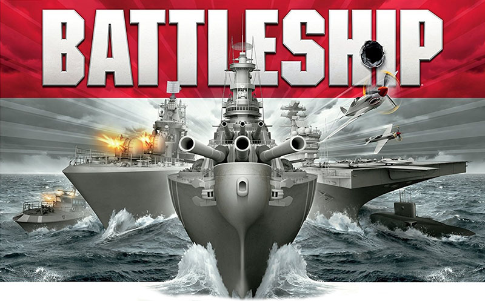

# sea_battle
  
C computer basics final project in Amirkabir University of Technology 
## description
this project was for my first semester computer basics course in [Amirkabir University of Technology](aut.ac.ir)
it is a simple implementation of battle ships game with some extra features which run in the terminal
and does not have a GUI.
  
## features
### main Features
- modes
    - :heavy_check_mark:  multiplayer
    - :heavy_check_mark:  single player
- map
    - :heavy_check_mark:  turn map
    - :heavy_check_mark:  result map
- game process
    - :heavy_check_mark:  ship placement
    - :heavy_check_mark:  nice turn mange system and shot connection gift
    - :heavy_check_mark:  nice turn system in multiplayer mode
    - :heavy_check_mark:  nice bot attacks in singleplayer
    - :heavy_check_mark:  game finish and score counting
- ships
    - :heavy_check_mark:  using linked list for implementation
- save data
   - :heavy_check_mark:  save game and load game and load last game
   - :heavy_check_mark:  save users and score board
- code quality
    - :heavy_check_mark:  clean code
    - :heavy_check_mark:  small functions
 
### extra point Features
- :heavy_check_mark: auto ship placement
- :heavy_check_mark: git
- :heavy_check_mark: nice graphics
- :heavy_check_mark:  nice file system
- :heavy_check_mark: nice debugging system(this is my own creation :blush:)

# development
In order to continue development first you have to clone the project  
`
$ git clone https://github.com/Noisyboy-9/sea_battle.git
`

the in the `main.c` file, placed at the root of the project change `isApplicationInProduction` to `false` 
